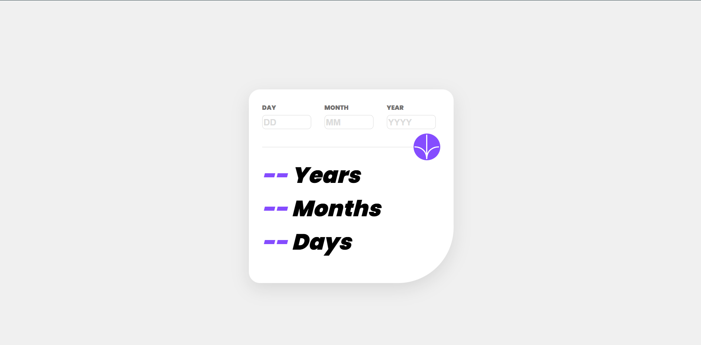

# Frontend Mentor - Age calculator app solution

This is a solution to the [Age calculator app challenge on Frontend Mentor](https://www.frontendmentor.io/challenges/age-calculator-app-dF9DFFpj-Q). Frontend Mentor challenges help you improve your coding skills by building realistic projects. 

### The challenge

Users should be able to:

- View an age in years, months, and days after submitting a valid date through the form
- Receive validation errors if:
  - Any field is empty when the form is submitted
  - The day number is not between 1-31
  - The month number is not between 1-12
  - The year is in the future
  - The date is invalid e.g. 31/04/1991 (there are 30 days in April)
- View the optimal layout for the interface depending on their device's screen size
- See hover and focus states for all interactive elements on the page

### Screenshot

### Links

- Live Site URL: https://the-holiest-potato.github.io/age-calculator/

### Built with

- Semantic HTML5 markup
- CSS custom properties
- Flexbox
- CSS Grid

### What I learned

- Practiced basic JavaScript concepts including:

     - querySelector() for selecting elements
     - AddEventListener() to handle button clicks
     - ParseInt() to convert input strings to numbers
     - If conditions to validate user input
     - Alert() to display error messages

- Still practicing HTML & CSS to:

## Acknowledgments

I would like to thank Frontend Mentor for providing the project challenge that helped me practice real-world front-end skills. I also referred to MDN Web Docs for understanding JavaScript methods like querySelector(), Date(), and DOM manipulation. Additionally, various YouTube tutorials guided me through basic JavaScript logic and validation techniques used in this project.

